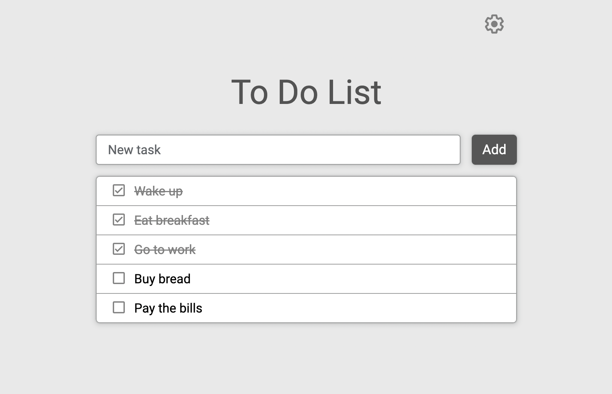

# To-Do List



<p>The classic To-Do List application where the user can write all the things he wants to accomplish.</p>

## Description

<p>Application is created using React.</p>
<p>State management is implemented using Redux.</p>
<p>Database is implemented using localStorage.</p>
<p>Design is inspired by Google Keep.</p>

## Installation and Usage

1. Clone the repository:
```
git clone https://github.com/ephraimbinyamin/To-Do.git
```

2. Go to project folder:
```
cd To-Do
```

3. Install NPM packages:
```
npm install
```

4. Start the project:
```
npm start
```

## Dependencies

|   Package     | Version |
|---------------|---------|
| react         | v18.2.0 |
| react-dom     | v18.2.0 |
| react-scripts | v5.0.1  |
| redux         | v4.2.0  |
| react-redux   | v8.0.5  |
| sass          | v1.55.0 |
| nanoid        | v4.0.0  |